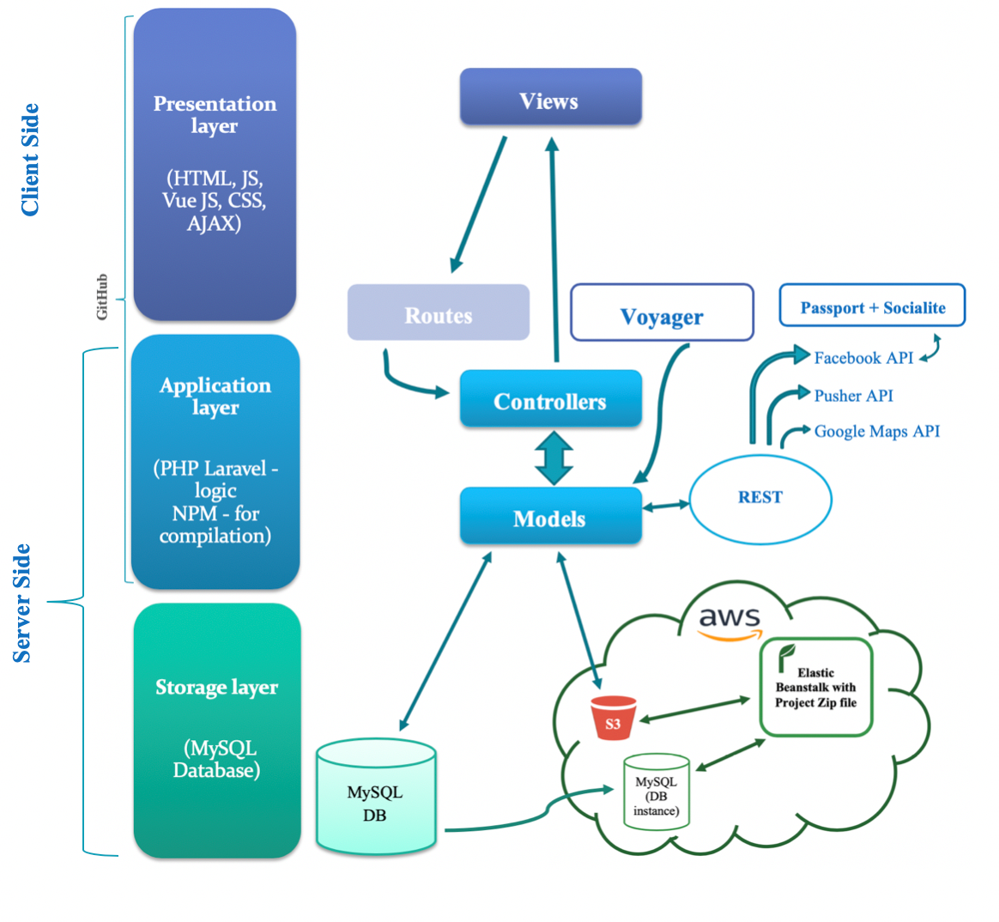
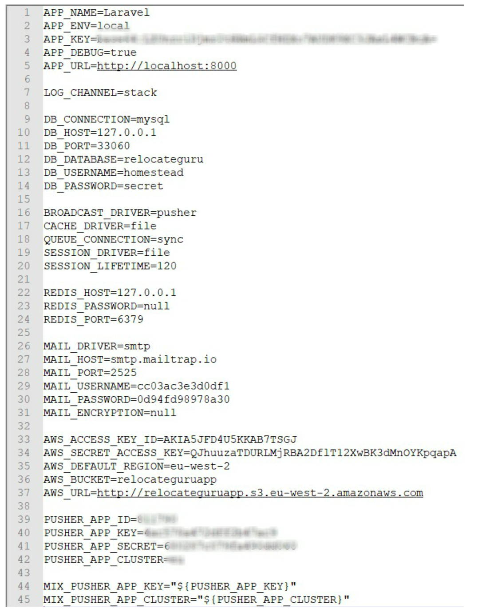
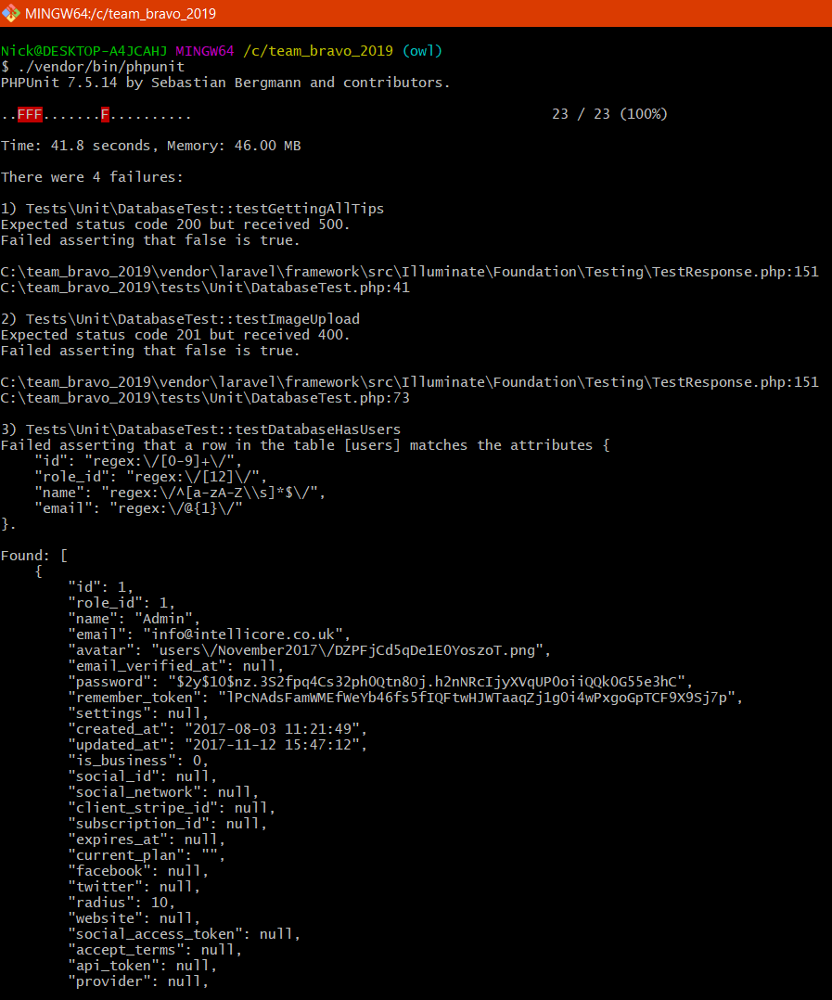
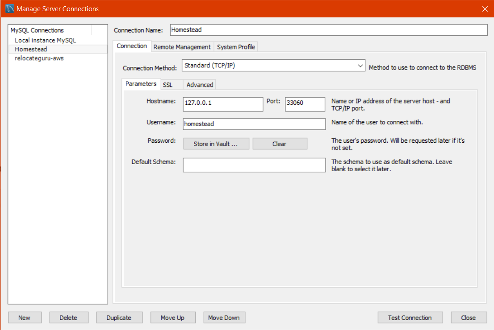
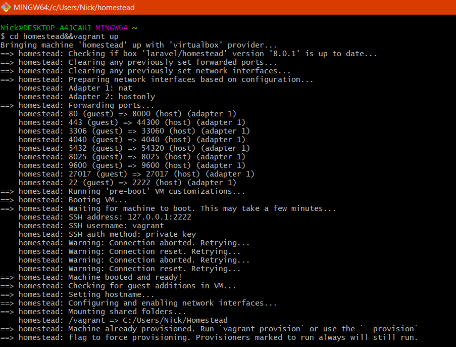
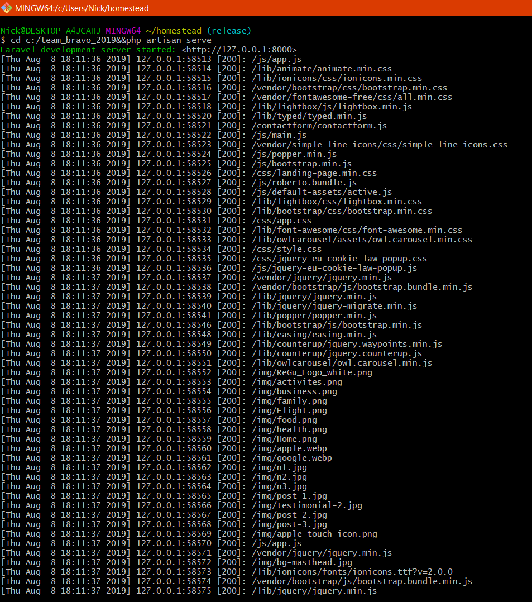
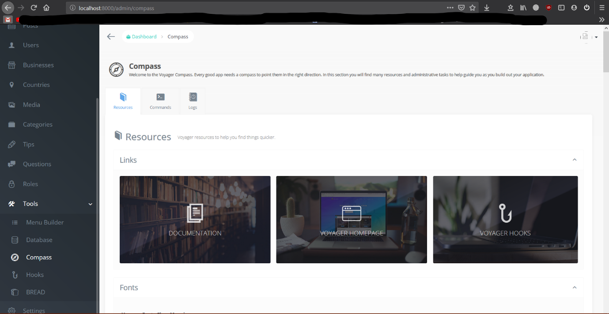

#
# RelocateGuru Web App

## Application purpose:

This web application is developed by MSc IT students of the Aberdeen University as a part of the project to complement the existing mobile RelocateGuru application. RelocateGuru aims to helps its users to find and organise everything they need to know about a town so they can get settled quicker. Through sharing local knowledge RelocateGuru aims to support and encourage friendly and cohesive communities so that everyone feels like a local.This version of the application is built for desktop browsers, and it will have a number of functionalities the mobile app doesn&#39;t have. The application was developed to fit the needs of different users, currently supporting guest, registered and admin users. RelocateGuru website has been designed with the basic functionality to serve as a basis for further implementation of social media, gamification and e-commerce functionalities.

_Web App System architecture (MVC in 3-Tier Architecture)_

## Getting Started

### Prerequisites

- **Packages used**
- Coderello/Laravel-passport-social-grant 2.0.0
- AWS SDK 3.107.1
- Voyager-deployment-orchestrator 2.0.2
- intervention/image 2.5.0
- Passport 7.3.2
- Socialite 4.1.3
- Pusher-php-server 4.0.0
- Voyager 1.2.6
- Laravel-decomposer 1.2.3

### Installing

To install the project, follow the steps below:

1. Clone/fork/download the project from Github repository [_https://github.com/UoA-CS5942/team\_bravo\_2019_], the project folder has all the essential packages already installed and configured there.
2. In case there are any issues, run &#39;composer install&#39; to ensure all packages are installed
3. Create the database by running DATABASE.sql script
4. Copy .env.example and rename it to .env
5. Fill out the .env file by specifying the database, AWS keys, Pusher keys etc
6. Run &#39;php artisan key:generate&#39; command from the root directory to create the application key.

Env file should look like on the image below:

## Testing the application

Tests can be run by using the following command from the root of the application &#39;./vendor/bin/phpunit&#39;.

Any additional tests can be created using &#39;php artisan make:test _TestName_&#39;, it will appear in tests directory.

## Deployment

To start a server instance use &#39;php artisan serve&#39;, then the site can be accessed at localhost:8000 or 127.0.0.1:8000; an admin account is included in the DB script (email: [teambravo2019@outlook.com](mailto:teambravo2019@outlook.com), password: bravo2019)

To grant a user all admin privileges use &#39;php artisan voyager:admin _your@email.com_&#39; (refer to Voyager&#39;s Compass for complete documentation of Voyager commands)

To access the admin dashboard visit/admin or click on Admin Controls menu in dropdown at the top-right corner the website&#39;s interface or in the user page (the option becomes visible when an admin credentials are used to log in)

**Using homestead**

(refer to [https://laravel.com/docs/5.8/homestead](https://laravel.com/docs/5.8/homestead) for complete Homestead documentation)

Clone Laravel homestead using &#39;git clone https://github.com/laravel/homestead.git ~/Homestead&#39;

Run &#39;init.bat&#39; or &#39;bash init.sh&#39; (for Windows and Mac/Linux respectively)

Configure Homestead.yaml

Download Homestead&#39;s Vagrant box with &#39;vagrant box add Laravel/homestead&#39;

To boot up Vagrant use &#39;vagrant up&#39;; &#39;vagrant halt&#39; stops the virtual machine

You can SSH into the virtual machine by using &#39;vagrant ssh&#39;

To connect to the DB use 127.0.0.1 with port 33060; default username is &#39;homestead&#39;, password is &#39;secret&#39;

**Example of running the server**

cd homestead &amp;&amp; vagrant up &amp;&amp; vagrant ssh (vagrant ssh only required for homestead)

cd c:/team\_bravo\_2019&amp;&amp;php artisan serve

## This Web Application has been built with:

- [Laravel](http://www.larvel.com) - The web framework used
- [NPM](https://www.npmjs.com/), [Composer](https://getcomposer.org/) - Dependency Management
- NPM 6.9.0
- PHP 7.3.6
- Apache 2.4
- Composer 1.8.5
- MySQL workbench 8.0.16
- GitBash 2.21.0.windows.1

_Alternatively use homestead with a virtual machine_

- _Homestead 9.0.7 + Laravel/homestead box 8.0.1_
- _Vagrant 2.2.4_
- _Virtual Box 6.0.10_

## Useful commands

Use &#39;php artisan cache:clear&#39; to clear the application&#39;s cache

Use &#39;php artisan config:clear&#39; to clear cached configs, which should be used after changing .env file or any config files in app/config directory

Use &#39;php artisan session:flush&#39; to truncate &#39;sessions&#39; table in the DB, which can be used to clear any currently signed in users – helpful when developing major functionalities

Refer to Voyager&#39;s Compass for more helpful commands

## These are the parts that are not working correctly

- Facebook login – issue with API keys
- Chat – not implemented
- Likes – not implemented
- Comments - bugged
- Images in Voyager - bugged
- Missing confirmation messages – login, tip create/delete, profile delete
- Tips don&#39;t have coordinates
- Map markers don&#39;t highlight corresponding tips
- Map markers to indicate tip&#39;s category – displayed as generic red markers
- Running commands from Compass – not working

## System decomposition report

_(also available at /decompose (requires being logged in with admin account)_

### Laravel Environment

- Laravel Version: 5.8.29

 - Timezone: UTC

 - Debug Mode: ✔

 - Storage Dir Writable: ✔

 - Cache Dir Writable: ✔

 - Decomposer Version: ^1.2

 - App Size: 217 MB

 ### Server Environment

 - PHP Version: 7.3.6

 - Server Software: PHP 7.3.6 Development Server

 - Server OS: Windows NT DESKTOP-A4JCAHJ 10.0 build 17763 (Windows 10) AMD64

 - Database: mysql

 - SSL Installed: ✘

 - Cache Driver: file

 - Session Driver: file

 - Openssl Ext: ✔

 - PDO Ext: ✔

 - Mbstring Ext: ✔

 - Tokenizer Ext: ✔

 - XML Ext: ✔

 ### Installed Packages &amp; their version numbers

 - coderello/laravel-passport-social-grant : ^2.0

 - drudge-rajen/voyager-deployment-orchestrator : ^2.0

 - fideloper/proxy : ^4.0

 - intervention/image : ^2.5

 - kitetail/zttp : ^0.6.0

 - laravel/framework : 5.8.\*

 - laravel/passport : ^7.3

 - laravel/socialite : ^4.1

 - laravel/tinker : ^1.0

 - laravelcollective/html : ^5.0

 - league/flysystem-aws-s3-v3 : ~1.0

 - lubusin/laravel-decomposer : ^1.2

 - pusher/pusher-php-server : ^4.0

 - tcg/voyager : ^1.2

## Created By Team Bravo:

- **Alina Kvaratskhelia**
- **Nikita Romanenko**
- **Sophie Ejura AKPA**
- **Jiaqi Deng**
- **Xie Guangxiao**
- **Chikezie Nnadozie**

## License

This project is licensed under the MIT License - see the [LICENSE.md](LICENSE.md) file for details
